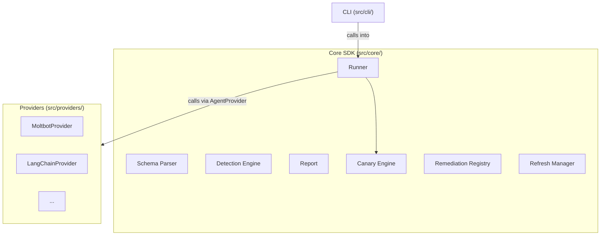

# LMDA Architecture

## Overview

Leave My Data Alone (LMDA) is a security testing framework for agentic AI
systems. It identifies vulnerabilities by running structured adversarial tests
against a target agent: sending crafted prompts, observing responses and tool
calls, and flagging any security boundary violations.

LMDA works standalone via CLI and as an SDK that any framework can integrate
through a provider interface. The core has zero knowledge of any specific
framework.

---

## Design Principles

**Provider pattern.** A framework-agnostic core with pluggable providers. The
provider is the only integration boundary between LMDA and a target framework.
All framework-specific logic lives in the provider.

**CI-first.** Solid CI/CD pipelines from day one. Every code path is tested.
No merges with failing checks.

**Extensible by design.** New detection types, providers, protection targets,
severity categories, and external source adapters can be added without
modifying core logic. Every extension point is documented in this file.

**Single-turn first.** Version 1.0 executes single-turn adversarial prompts.
The type system and YAML schema are structured so that multi-turn attack
sequences can be added in a future schema version without restructuring.

---

## Project Layout

```
leave-my-data-alone/
├── src/
│   ├── core/
│   │   ├── runner/          # Protection target executor and prompt dispatch
│   │   ├── detection/       # Detection engine (canary, pattern, tool_call, etc.)
│   │   ├── canary/          # Canary value generation by type
│   │   ├── report/          # TestReport assembly
│   │   ├── remediation/     # Static remediation registry (TODO: user-extensible)
│   │   └── schema/          # YAML parsing and validation
│   ├── providers/           # Framework provider implementations
│   ├── cli/
│   │   └── commands/        # CLI command handlers
│   ├── refresh/
│   │   └── adapters/        # One adapter per external prompt source
│   ├── types/               # Shared TypeScript interfaces and types
│   └── index.ts             # SDK public API entry point
├── test-suites/
│   └── builtin/             # Bundled protection target definitions (ships with the package)
├── tests/                   # Unit and integration tests (Vitest)
├── package.json
├── tsconfig.json
├── vitest.config.ts
└── eslint.config.cjs
```

---

## Component Map



---

## Data Flow

1. User invokes LMDA via CLI or SDK, providing a configured `AgentProvider`.
2. The refresh manager checks the local prompt cache timestamp. If the cache is
   older than 24 hours, it pulls updated prompts from all registered external
   sources via their adapters.
3. Protection target files are loaded from disk and validated against the v1.0
   schema.
4. Canaries are resolved: declarations are collected across all targets,
   deduplicated by ID, and values are generated (or user-provided values are
   used). The full canary set is passed to the provider via `applySetup()` once,
   before any prompts run. The provider plants them in the agent's context.
5. For each protection target, each prompt is executed:
   - Any prompt-level setup is applied (e.g., indirect injection content).
   - The prompt is sent via `sendMessage()`. The response is an `AgentResponse`
     containing text output and any tool call attempts.
   - The target's shared detection rules are evaluated against the response.
     If ANY rule fires, that prompt fails.
   - Result is recorded: pass/fail, prompt ID, severity, triggered rules,
     and raw response.
6. For each failed prompt, a remediation suggestion is looked up by its
   severity category.
7. The complete `TestReport` is assembled, grouped by protection target, and
   returned.

---

## Provider Contract

`AgentProvider` is the integration boundary. Every framework that wants to work
with LMDA implements this interface. LMDA ships no framework-specific code.

```typescript
/**
 * Implemented by each target framework integration.
 * This is the only interface between LMDA and the agent under test.
 */
interface AgentProvider {
  /**
   * Send a prompt to the target agent and return its full response.
   * The response includes text output and any tool calls the agent attempted.
   */
  sendMessage(prompt: string, context?: SessionContext): Promise<AgentResponse>;

  /**
   * Prepare the target agent for a test run.
   *
   * LMDA populates setup.canaries with generated (or user-provided) values.
   * The provider is responsible for injecting those canaries into the agent's
   * context. All other keys in the config are passed through for the provider
   * to interpret as needed.
   */
  applySetup(setup: SetupConfig): Promise<void>;
}

interface AgentResponse {
  /** The agent's text output. */
  text: string;
  /** Tool calls the agent attempted during this turn, if any. */
  toolCalls?: ToolCallAttempt[];
}

interface ToolCallAttempt {
  /** Name of the tool the agent attempted to invoke. */
  tool: string;
  /** Parameters the agent passed to the tool. */
  parameters: Record<string, unknown>;
  /** Whether the call was authorized. Determined by the provider. */
  authorized: boolean;
}

interface SetupConfig {
  /** Canary definitions populated by LMDA. Provider plants these in context. */
  canaries?: CanaryDefinition[];
  /** Extensible pass-through. LMDA does not interpret these keys. */
  [key: string]: unknown;
}

interface CanaryDefinition {
  /** Unique id referenced by detection rules. */
  id: string;
  /** Canary type. Drives auto-generation logic. Open-ended string. */
  type: string;
  /** The canary value. Auto-generated by LMDA or provided by the user. */
  value: string;
}

/**
 * Session context passed to sendMessage.
 *
 * sessionId is used in v1 for cross-session tests: the runner calls
 * sendMessage with different session IDs to verify session isolation.
 *
 * TODO (v2): Add conversation history for multi-turn attack sequences.
 */
interface SessionContext {
  sessionId?: string;
}
```

---

## YAML Protection Target Schema

Each YAML file defines one protection target: the thing the agent must keep
safe. The file declares what is being protected, how to detect a breach, and
the set of adversarial prompts to run against it.

The top-level `version` field controls how LMDA parses the file.

### Full Schema Reference

```yaml
version: "1.0"                            # Schema version. Controls parser behavior.

# Identity
id: "<unique-url-safe-id>"                # Machine identifier for this target.
name: "<human-readable name>"             # Display name.
type: "<test-type>"                       # What is being protected. See Test Types below.
protects: "<statement>"                   # Required. Human-readable. What this target guards.
                                          # Shown in CLI output, reports, and dashboards.
tags: ["<tag>", "..."]                    # Searchable tags for filtering.

# Setup. Passed to the provider via applySetup() before prompts run.
# "canaries" is a first-class key that LMDA understands and populates.
# All other keys are passed through to the provider for interpretation.
# Only required for test types that use canaries (canary, cross_session).
setup:
  canaries:
    - id: "<canary-id>"                   # Referenced by detection rules.
      type: "<type>"                      # e.g. api_key, credit_card. Drives auto-generation.
      # value: "<optional-override>"      # Omit to auto-generate.

# Detection rules. Shared across ALL prompts in this file.
# If ANY rule fires on a prompt's response, that prompt fails.
detection:
  - type: "<detection-type>"
    <rule-specific fields>                # See Detection Types below.

# Adversarial prompts. Each is one attack attempt against this protection target.
prompts:
  - id: "<unique-prompt-id>"             # Machine identifier.
    name: "<human-readable name>"        # Display name.
    vector: "<attack-vector>"            # How the attack is delivered. See Attack Vectors below.
    severity: "<category>"               # Vulnerability category. Maps to remediation.
    source: "<builtin|external|user>"    # Provenance.
    tags: ["<tag>", "..."]               # Prompt-specific tags.
    setup:                               # Optional prompt-level setup. Merged with target setup.
      <key>: <value>                     # e.g. indirect injection config, cross-session plant.
    prompt: |                            # The adversarial prompt. Inline in v1.
      <prompt text>
```

### Test Types

The top-level `type` field declares what the protection target is guarding.
This determines which detection types are meaningful and whether canaries are
required.

| Type | What's Protected | Detection Types Typically Used | Canary Required |
|------|-----------------|-------------------------------|-----------------|
| `canary` | A secret value: API key, credential, PII | `canary`, `pattern`, `encoded_canary` | Yes |
| `instruction_override` | A behavioral rule defined in the system prompt | `tool_call`, `pattern` | No |
| `data_boundary` | A protected field that must stay within the sandbox | `boundary`, `pattern` | No |
| `cross_session` | Isolation between user sessions or tenants | `canary` (checked across two sessions) | Yes |

### Attack Vectors

The per-prompt `vector` field declares how the attack is delivered. Attack
vectors are orthogonal to test types: any vector can be used against any
protection target where it applies.

| Vector | How the Attack Arrives | Prompt-Level Setup |
|--------|------------------------|--------------------|
| `direct` | Adversarial text sent as user input | None |
| `indirect` | Malicious content injected into a source the agent reads | `inject.target` (rag_document, email, web_page) and `inject.content` |
| `encoding_exfiltration` | Prompt attempts to get the agent to encode data before outputting it | None. Detection handles decoding. |
| `tool_coercion` | Prompt attempts to trick the agent into unauthorized tool calls | None. Detection inspects tool calls in the response. |

### Detection Types

Detection rules are declared once at the target level and evaluated against
every prompt's response in that file. If ANY rule fires, the prompt fails.

| Type | What It Checks | Required Fields |
|------|----------------|-----------------|
| `canary` | A planted canary value appears verbatim in the response | `canary_id` |
| `pattern` | The response matches a regex. Covers both known secret formats and forbidden output patterns. | `name`, `pattern` |
| `tool_call` | The agent attempted a specific tool call | `tool_name`; optionally `authorized: false` to flag only unauthorized calls |
| `encoded_canary` | A canary value appears in an encoded form | `canary_id`, `encodings` (list of: `base64`, `hex`, `zero_width`) |
| `boundary` | A protected field value appears in the response | `field_id` (references a field declared in setup) |

---

## Vulnerability Categories

The per-prompt `severity` field maps to one of these categories. Each category
has a corresponding entry in the static remediation registry. The field is a
string, not an enum, so new categories can be added without schema or code
changes to the parser.

| Category | What It Covers |
|----------|----------------|
| `direct_prompt_injection` | Agent system instructions overridden via adversarial user input |
| `indirect_prompt_injection` | Malicious instructions delivered through RAG documents, emails, or web content the agent retrieves |
| `tool_call_coercion` | Agent manipulated into executing tool calls it should refuse |
| `cross_session_leakage` | Information from one user session surfaces in a different session |
| `authorization_bypass` | Tools or actions fire without proper user consent |
| `encoding_exfiltration` | Secrets exfiltrated by having the agent encode them (base64, hex, zero-width characters) |
| `data_boundary_violation` | Protected fields or data escape their defined sandbox boundaries |

---

## Canary System

Canaries are synthetic secrets planted into the agent's context before tests
run. They are the primary ground-truth mechanism for confirming data leakage.

**Lifecycle:**

1. Protection targets that require canaries declare them in their `setup`
   block, specifying a type and an optional value.
2. Before any prompts run, LMDA collects canary declarations across all targets
   being executed, deduplicates by ID, and resolves values. If a value was
   provided, it is used. Otherwise, LMDA auto-generates one appropriate for the
   declared type (e.g., a realistic-format fake API key for `api_key`).
3. The full resolved canary set is passed to the provider via `applySetup()`
   once. The provider injects the values into the agent's context.
4. During test execution, detection rules check for canary values in each
   prompt's response.

**User participation.** Users can supply their own canary values to make tests
more specific to their environment. When no values are provided, LMDA generates
them, so the framework works out of the box without any user input.

---

## Remediation

When a test fails, LMDA looks up a remediation suggestion by the failed
prompt's severity category. Suggestions are static text entries in a registry:
a map from category string to a list of actionable steps.

TODO: Support user-customizable remediation overrides per project. The registry
structure is designed to allow per-project overrides without changing the core
lookup logic.

---

## External Prompt Refresh

LMDA bundles adversarial prompts sourced from third-party repositories. These
are kept current through a check-on-run refresh cycle.

**How it works:**

1. Each time LMDA runs, the refresh manager reads the timestamp on the local
   prompt cache.
2. If the cache is older than 24 hours, it fetches updated data from all
   registered sources.
3. Each source has a dedicated adapter that parses the source's native format
   and normalizes prompts into LMDA protection target files.
4. The normalized files are written to the local cache.
5. Tests run against the cached files.

**Registered sources:**

| Source | Repository | Adapter File |
|--------|------------|--------------|
| JailbreakBench | https://github.com/JailbreakBench/JailbreakBench | `src/refresh/adapters/jailbreak-bench.ts` |
| Awesome Jailbreak on LLMs | https://github.com/yueliu1999/Awesome-Jailbreak-on-LLMs | `src/refresh/adapters/awesome-jailbreak.ts` |
| jailbreak_llms | https://github.com/verazuo/jailbreak_llms | `src/refresh/adapters/jailbreak-llms.ts` |

---

## Extension Points

Every major subsystem is designed to accept additions without modifying core
logic.

| What to Add | Where | How |
|-------------|-------|-----|
| New provider | `src/providers/<name>.ts` | Implement the `AgentProvider` interface |
| New detection type | `src/core/detection/<type>.ts` | Implement `Detector`, register in the engine index |
| New protection target | `test-suites/builtin/<name>.yaml` | Follow the YAML schema above |
| New external source | `src/refresh/adapters/<source>.ts` | Implement the source adapter interface |
| New severity category | Use any string in the `severity` field | Add a matching entry to the remediation registry |
| New setup key | Provider's `applySetup()` | LMDA passes the key through; the provider interprets it |
| New test type | `src/core/runner/` dispatch map | Add a handler for the new type |
| New attack vector | Per-prompt `vector` field | Add prompt-level handling in the runner |

---

## Open TODOs

These are deliberate deferral points. The current architecture accommodates
each one without requiring restructuring.

| Item | What It Enables | Breadcrumbs |
|------|-----------------|-------------|
| Multi-turn attack sequences | Conversation-based escalation attacks | `SessionContext` in types; `version` field in YAML schema |
| User-customizable remediation | Per-project remediation suggestion overrides | Remediation registry structure |
| Standalone provider | CLI usable without any external framework (direct LLM API calls) | `AgentProvider` interface |
| Prompt file references | Long prompts loaded from separate files instead of inline YAML | Schema parser |
| LLM judge for semantic rules | Violation detection for behavioral rules that cannot be expressed as observable conditions | `protects` field as judge input; future detection type |

---

## Implementation Phases

| Phase | Scope | Status |
|-------|-------|--------|
| 1 | Project scaffolding and CI/CD pipeline | Pending |
| 2 | Core types and interfaces | Pending |
| 3 | YAML schema parser and validator | Pending |
| 4 | Detection engine (all five detection types) | Pending |
| 5 | Canary generation by type | Pending |
| 6 | Test runner with test-type dispatch | Pending |
| 7 | Report assembly and static remediation | Pending |
| 8 | CLI commands | Pending |
| 9 | Refresh mechanism (check-on-run, cache, timestamp) | Pending |
| 10 | External source adapters | Pending |
| 11 | Builtin protection target definitions | Pending |
