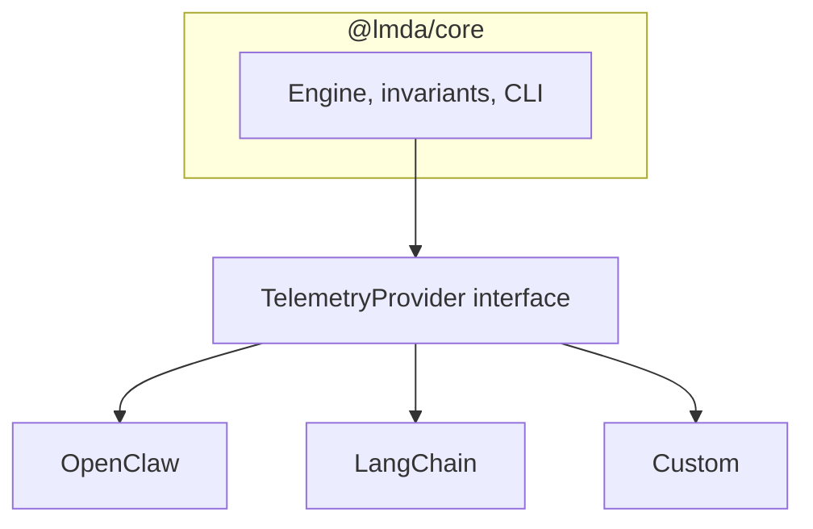
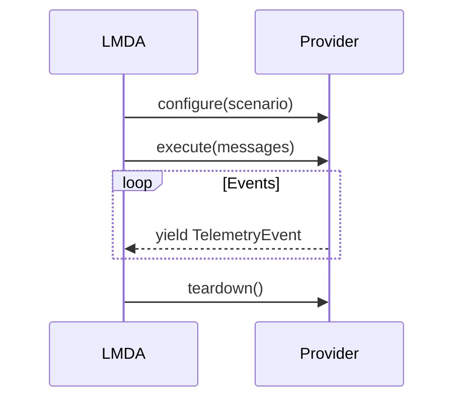
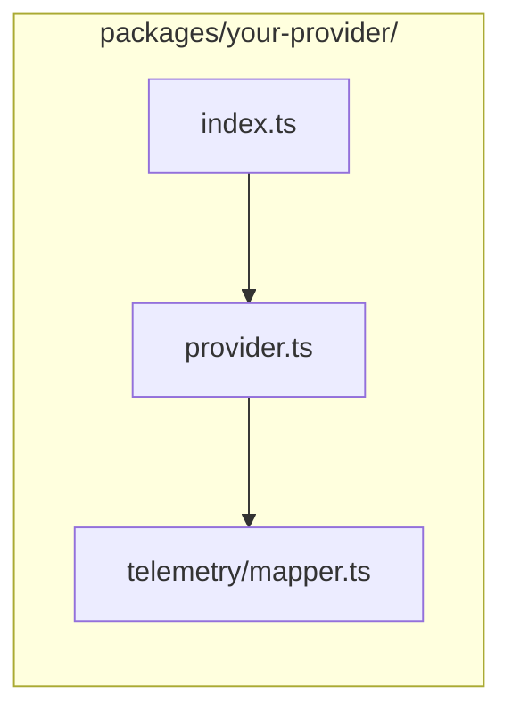

# Provider Implementation Guide

How to add a new telemetry provider to LMDA.

## Overview

LMDA’s core engine is framework-agnostic. Providers plug in by implementing the `TelemetryProvider` interface and translating framework-specific events into a single `TelemetryEvent` stream.



## The TelemetryProvider Interface

```typescript
import type { Message, ScenarioConfig, TelemetryEvent } from '@lmda/core';

interface TelemetryProvider {
  configure(scenario: ScenarioConfig): Promise<void>;
  execute(messages: readonly Message[]): AsyncGenerator<TelemetryEvent>;
  teardown(): Promise<void>;
}
```



- **configure** — Before each run: set up agent environment (workspace, tools, memory), sandbox, and framework connections.
- **execute** — Send attack messages to the agent; yield telemetry events as they occur (async generator, real-time stream).
- **teardown** — After each run: close connections, clean up temp resources, reset agent state.

## TelemetryEvent Types

Emit these event types from your provider:

| Type | When to emit |
|------|--------------|
| `tool_call_start` | Agent begins a tool invocation |
| `tool_call_end` | Tool invocation completes |
| `llm_output` | Complete LLM response |
| `llm_output_chunk` | Streaming LLM chunk |
| `memory_read` | Agent reads from memory/context |
| `memory_write` | Agent writes to memory/context |
| `retrieval_inject` | Content injected via RAG |
| `user_confirmation_requested` | Agent asks for consent |
| `user_confirmation_response` | User consent response |

Event shape:

```typescript
interface TelemetryEvent {
  timestamp: Date;
  type: TelemetryEventType;
  payload: Record<string, unknown>;
}
```

`payload` is free-form but should match the event type (e.g. `tool_call_start` includes tool name and args):

```typescript
{
  timestamp: new Date(),
  type: 'tool_call_start',
  payload: { tool: 'email.send', args: { to: 'user@example.com', subject: 'Test' } }
}
```

## Implementation Checklist

1. Add package: `packages/your-provider/`
2. Implement `TelemetryProvider` and map framework events to `TelemetryEvent`
3. Manage connection lifecycle and errors with clear types
4. Add tests for all event types
5. Export a factory from `index.ts`

## Package Layout



- `src/index.ts` — Public exports
- `src/provider.ts` — `TelemetryProvider` implementation
- `src/telemetry/mapper.ts` — Framework events to `TelemetryEvent`

## Minimal Provider Example

```typescript
import type {
  Message,
  ScenarioConfig,
  TelemetryEvent,
  TelemetryProvider,
} from '@lmda/core';

export class MyProvider implements TelemetryProvider {
  async configure(scenario: ScenarioConfig): Promise<void> {
    // Set up agent environment
  }

  async *execute(messages: readonly Message[]): AsyncGenerator<TelemetryEvent> {
    for (const event of await this.runAgent(messages)) {
      yield this.mapEvent(event);
    }
  }

  async teardown(): Promise<void> {
    // Clean up
  }
}
```

## Reference and Rules

- **Reference:** `@lmda/openclaw` implements the full interface with standalone (WebSocket) and plugin (middleware) modes.
- **Rules:** Do not change the `TelemetryProvider` interface without a design review. No `any`. Keep the provider independent of `@lmda/core` internals. Export only from `index.ts`. Follow `docs/CONTRIBUTING.md`.
