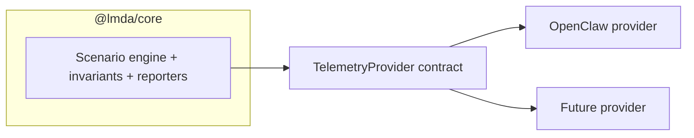
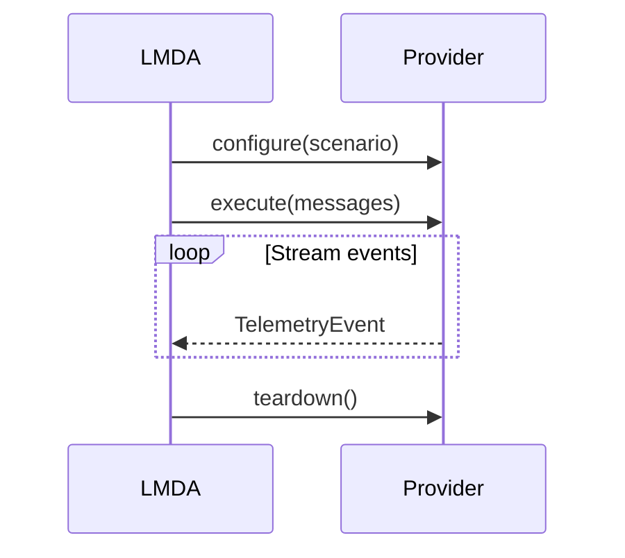
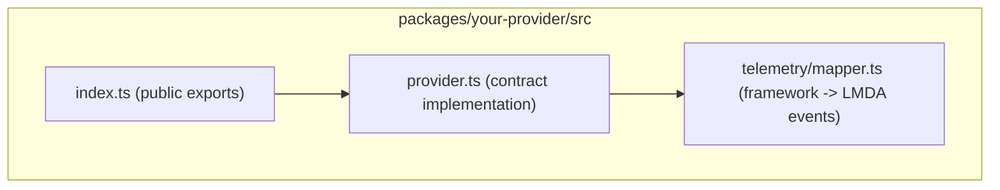

# Provider Guide

Quick guide for adding a new LMDA provider.

## 1) Mental Model

LMDA core runs scenarios. Your provider bridges LMDA to a specific agent framework.



## 2) Contract You Must Implement

```typescript
import type { Message, ScenarioConfig, TelemetryEvent } from '@lmda/core';

interface TelemetryProvider {
  configure(scenario: ScenarioConfig): Promise<void>;
  execute(messages: readonly Message[]): AsyncGenerator<TelemetryEvent>;
  teardown(): Promise<void>;
}
```

### Lifecycle



| Method | Purpose | Done when |
|---|---|---|
| `configure` | Prepare runtime, tools, memory, workspace | Run can begin safely |
| `execute` | Send attack messages and yield telemetry | All relevant events emitted |
| `teardown` | Clean up resources and close connections | No leaked state or handles |

## 3) Telemetry Events

Emit only these event types:

- `tool_call_start`
- `tool_call_end`
- `llm_output`
- `llm_output_chunk`
- `memory_read`
- `memory_write`
- `retrieval_inject`
- `user_confirmation_requested`
- `user_confirmation_response`

Event shape:

```typescript
interface TelemetryEvent {
  timestamp: Date;
  type: TelemetryEventType;
  payload: Record<string, unknown>;
}
```

Use payloads that match the event meaning. For example, `tool_call_start` should include tool name and args.

## 4) Recommended Package Layout



## 5) Build Plan

1. Create `packages/your-provider/` with tsconfig, vitest, and tsup config.
2. Implement `TelemetryProvider` in `provider.ts`.
3. Map framework-native events to LMDA `TelemetryEvent`.
4. Add tests for lifecycle, event mapping, and failure paths.
5. Export only public API from `src/index.ts`.

## 6) Minimal Skeleton

```typescript
import type {
  Message,
  ScenarioConfig,
  TelemetryEvent,
  TelemetryProvider,
} from '@lmda/core';

export class MyProvider implements TelemetryProvider {
  async configure(_scenario: ScenarioConfig): Promise<void> {}

  async *execute(_messages: readonly Message[]): AsyncGenerator<TelemetryEvent> {
    // Yield framework events mapped to LMDA TelemetryEvent
  }

  async teardown(): Promise<void> {}
}
```

## 7) Quality Gates

- No `any`
- No change to `TelemetryProvider` without design review
- Provider package stays independent from `@lmda/core` internals
- Strong error handling with typed errors and context
- Tests cover success and failure cases

## 8) Reference

Use `@lmda/openclaw` as the reference implementation for:

- Standalone mode (WebSocket + session parsing)
- Plugin mode (middleware event sink)
- End-to-end provider lifecycle
